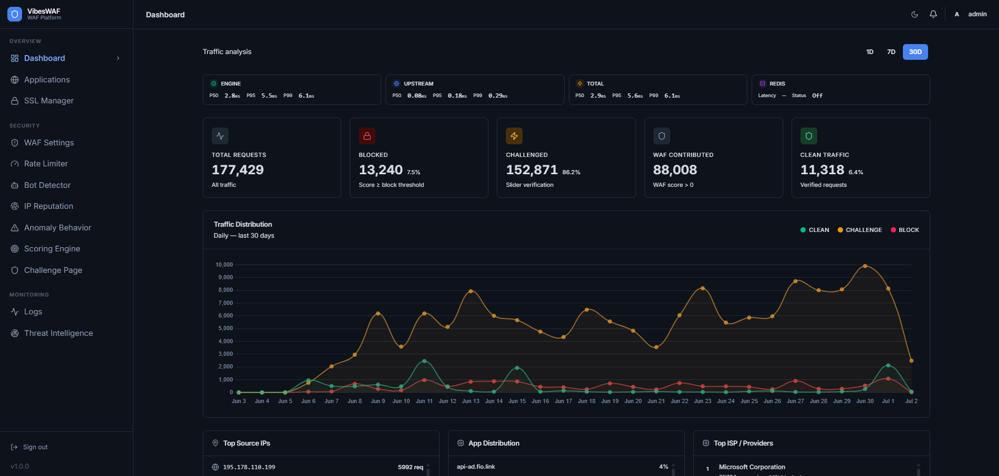
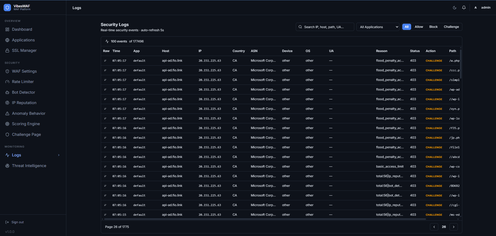

# VibesWAF

A reverse proxy and WAF built for personal use and experimentation. Not production-hardened, not battle-tested: just a project to learn how WAFs work from the inside.

<table>
  <tr>
    <td width="50%"></td>
    <td width="50%"></td>
  </tr>
</table>

<p align="center">Built in Go. Uses Coraza + OWASP CRS for managed rules, PostgreSQL for config, ClickHouse for logs, Redis for state.</p>

<p align="center">
  
  
  
  
  
</p>

---

## Demo

Live demo at [vibeswaf.tailgo.com](https://vibeswaf.tailgo.com)
* user: `vibeswaf`
* pass: `vibeswaf`

> Runs in read-only mode for global config. Per-app settings are fully editable. 

> Backend: $14/year VPS (2 vCore, 4 GB RAM), Ubuntu 24.04.

---

## How it works

OpenResty 1.29.2.3 handles TLS termination and dynamic SSL (no restart). All WAF logic runs in Go.

```
Request -> OpenResty (SSL) -> Go WAF Pipeline -> Phase 1 (Hard Rules) -> Phase 2 (Scoring) -> Phase 3 (Decision) -> Phase 4 (Response) -> Upstream
```

[Pipeline flow](docs/pipeline-flow.md) | [Phase 1: Hard Rules](docs/phase1-hard-rules.md) | [Phase 2: Scoring](docs/phase2-scoring.md) | [Phase 3: Decision](docs/phase3-decision.md) | [Challenge Trust Levels](docs/challenge-trust-levels.md)

---

## Dashboard

Web UI managing all configuration  applications, security rules, rate limiter, bot detector, WAF engine, IP reputation, scoring engine, logs, and analytics.

[`Apps`](screenshot/2.%20App-basic.png) [`Security Rules`](screenshot/2.%20App-security-rules.png) [`Rate Limiter`](screenshot/4.%20Rate%20limiter%20-%20Food%20protection.png) [`Bot Detector`](screenshot/5.%20Bot%20Detector.png) [`WAF`](screenshot/3.%20Waf%20Settings.png) [`IP Reputation`](screenshot/6.%20IP%20Reputation.png) [`Scoring`](screenshot/8.%20Scoring.png) [`Logs`](screenshot/10.%20Logs.png) [`Analytics`](screenshot/12.%20Threat%20Inteligence.png)

---

## Stack

| Component | Role |
|---|---|
| Go | Core proxy + pipeline |
| OpenResty 1.29.2.3 | TLS termination, JA4 fingerprinting via [lua-resty-ja4](https://github.com/nemethhh/lua-resty-ja4) |
| Coraza + OWASP CRS | Managed WAF rules |
| PostgreSQL | Config storage |
| ClickHouse | Request logs + analytics |
| Redis | Rate limit, challenge store, trust history |
| React + Vite | Dashboard |

---

## Setup

```sh
cp .env.example .env && ./vibeswaf     # backend
cd frontend && cp .env.example .env && bun install && bun run build  # frontend
```

See `config/` for nginx, systemd, and ACME scripts.

---

## Caveats

* Personal project. No SLA.
* Code assisted by AI. Architecture designed by hand.
* Test coverage is partial.
* Not designed for multi-tenant.
